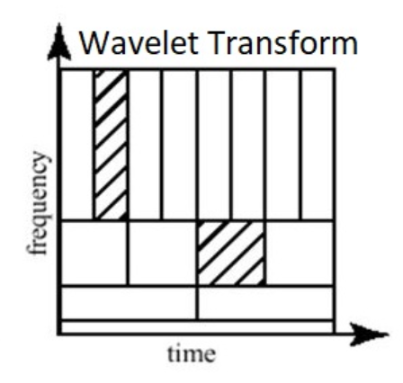

# Design and Implementation of 3-level Discrete Wavelet Transform (DWT) using Lifting Scheme  

## Abstract  
This project presents a **3-level one-dimensional (1D) Discrete Wavelet Transform (DWT)** architecture implemented using the **lifting scheme** in SystemVerilog. It is designed for **eight 16-bit input samples**, although it can be scaled for different word lengths and sample sizes.  

The lifting scheme is chosen for its **computational efficiency** and **hardware-friendly nature**, allowing in-place calculations with reduced memory usage compared to traditional convolution-based DWT.  
 
---

The architecture is optimized for:  
- Efficient resource utilization  
- Modular design  
- Low-latency operation  

It consists of clearly defined functional blocks:  
- Predictor and update modules  
- FIFO buffers  
- Multiplexers  
- Controller (FSM)  

**Target Applications:** Real-time signal processing, compression, biomedical signal analysis, and embedded sensing.  

Validation is performed using **self-checking SystemVerilog testbenches**, comparing hardware-generated coefficients against MATLAB references. Simulation results demonstrate accurate multi-level decomposition and clear separation of approximation and detail coefficients.  

---

## I. Introduction  
Wavelet transforms provide a **compact, multiresolution representation** of signals, capturing both **time and frequency** information.  

- **STFT (Short-Time Fourier Transform):** Uses fixed windows → poor adaptability  
- **Wavelets:** Adaptive resolution → good time resolution at high frequencies, good frequency resolution at low frequencies  
 
The **lifting scheme** decomposes DWT into steps:  
- Split  
- Predict  
- Update  

For **integer-to-integer transforms** (LeGall 5/3 wavelet), lifting requires only additions, subtractions, and shifts → ideal for **FPGA/ASIC**.  

**Contributions of this work:**  
- Detailed explanation of DWT (with 5/3 lifting)  
- Floating-point and integer equations  
- Modular SystemVerilog design (predictor, updater, FIFOs, controller)  

---

## II. Coarse and Detail Coefficients  
A single-level DWT splits the signal:  

- **Approximation (a[n])**: low-pass, coarse features  
- **Detail (d[n])**: high-pass, sharp changes, edges  

These allow **exact reconstruction** with inverse DWT.  

For compression:  
- Many detail coefficients are near-zero → aggressive quantization possible.  

---

## III. Background  

### A. From FT to Wavelets  
- **Fourier Transform (FT):** Frequency only, no time localization  
- **FFT:** Efficient FT, same limitation  
- **STFT:** Localizes frequency but uses fixed window → tradeoff  
- **Wavelets:** Multi-resolution, localized in both time and frequency  

 
---

### B. Wavelet Theory Essentials  
# B. Wavelet Theory Essentials

The **Discrete Wavelet Transform (DWT)** decomposes a signal `x[n]` into **approximation** and **detail coefficients** using **filtering and downsampling**.

## 1. Analysis (Decomposition) Stage
- The signal is passed through **two analysis filters**:
  - **Low-pass filter (LPF):** extracts the **approximation coefficients** `a[n]` (captures the low-frequency content).  
  - **High-pass filter (HPF):** extracts the **detail coefficients** `d[n]` (captures the high-frequency content).  
- After filtering, **downsampling by 2** is applied to reduce the number of samples by half.
Mathematically:

$$
a[n] = \sum_k x[k] \cdot h[2n - k] \quad \text{(LPF + downsample)}
$$
$$
d[n] = \sum_k x[k] \cdot g[2n - k] \quad \text{(HPF + downsample)}
$$

## 2. Synthesis (Reconstruction) Stage
- To reconstruct the original signal, **upsampling by 2** is applied to both `a[n]` and `d[n]`, followed by **synthesis filters** (LPF and HPF) and summation:

$$
x[n] = \sum_k a[k] \cdot h'[n - 2k] + \sum_k d[k] \cdot g'[n - 2k]
$$

Where `h'` and `g'` are the **synthesis filters** corresponding to the LPF and HPF.

---
### Three-Level DWT Decomposition with Low-Pass (h[n]) and High-Pass (g[n]) Filters

 
---

### Implementation Methods

The **5/3 wavelet** can be implemented using either **convolution filters** or the **lifting scheme**. Although the algorithms look different, they are **mathematically equivalent** ,the lifting scheme is computationally efficient.

---

## 1. Convolution-based DWT

The 5/3 wavelet convolution filters are:

**Low-pass filter (LPF):**

$$
h[n] = [-\tfrac{1}{8}, \tfrac{1}{4}, \tfrac{3}{4}, \tfrac{1}{4}, -\tfrac{1}{8}]
$$

**High-pass filter (HPF):**

$$
g[n] = [-\tfrac{1}{2}, 1, -\tfrac{1}{2}]
$$

DWT convolution formulas:

$$
a[n] = \sum_k x[k] \cdot h[2n - k], \quad
d[n] = \sum_k x[k] \cdot g[2n - k]
$$

---
### C. DWT (5/3) Lifting Scheme  

**Steps:**  
1. Split: Separate even and odd samples  
2. Predict: Use even samples to predict odd → detail `d[i]`  
3. Update: Use details to update even → approximation `a[i]`  

**Step 1: Split even and odd samples**

$$
x_e[n] = x[2n], \quad x_o[n] = x[2n+1]
$$

**Step 2: Predict step (detail coefficients)**

$$
d[n] = x_o[n] - \tfrac{1}{2} \cdot (x_e[n] + x_e[n+1])
$$

**Step 3: Update step (approximation coefficients)**

$$
a[n] = x_e[n] + \tfrac{1}{4} \cdot (d[n-1] + d[n])
$$

---

## 3. Expand Lifting Steps to Original Signal 

**Step 3a: Substitute `d[n]` and `d[n-1]` into `a[n]`**

$$
a[n] = x_e[n] + \tfrac{1}{4}\Big(
(x_o[n-1] - \tfrac{1}{2}(x_e[n-1] + x_e[n])) +
(x_o[n] - \tfrac{1}{2}(x_e[n] + x_e[n+1]))
\Big)
$$

$$
a[n] = -\tfrac{1}{8}x_e[n-1] + \tfrac{1}{4}x_o[n-1]
       + \tfrac{3}{4}x_e[n]   + \tfrac{1}{4}x_o[n]
       - \tfrac{1}{8}x_e[n+1]
$$

This exactly matches the **LPF convolution coefficients**:

$$
h[n] = [-\tfrac{1}{8}, \tfrac{1}{4}, \tfrac{3}{4}, \tfrac{1}{4}, -\tfrac{1}{8}]
$$

---

**Step 3b: Detail coefficients**

$$
d[n] = x_o[n] - \tfrac{1}{2} \cdot (x_e[n] + x_e[n+1])
= -\tfrac{1}{2} \cdot x_e[n] + x_o[n] - \tfrac{1}{2} \cdot x_e[n+1]
$$

This matches the **HPF convolution coefficients**:

$$
g[n] = [-\tfrac{1}{2}, 1, -\tfrac{1}{2}]
$$

---

### D. Multi-level Decomposition  

Recursion:  
x[n] → {a(1), d(1)}
a(1) → {a(2), d(2)}
a(2) → {a(3), d(3)}

  

---

## IV. Architecture Overview  

### Modules  
- **Predictor** → computes `d[i]`  
- **Update** → computes `a[i]`  
- **FIFO Buffers** → align sample timing  
- **MUX** → selects input stream  
- **Registers (D1–D4)** → intermediate storage  
- **Controller (FSM)** → manages sequencing  

  

### Top-level Integration  
- Unified design integrates all modules  
- Input: **16-bit stream**  
- Output: **7 detail coefficients + 1 approximation coefficient**  

  

---
### V. STATE TRANSISTION DIAGRAM

The FSM cycles through **data input → residual processing → next level**, repeating until the third level completes. The `count` and `valid_in` signals govern transitions, ensuring synchronization with input streaming and intermediate coefficient availability.

  

This FSM guarantees that the three-level decomposition is performed sequentially with precise timing control, preventing data hazards.

---
### VI. CONTROLLER DESIGN

The architecture employs **two controllers** to manage sequencing, synchronization, and data flow across the lifting-based DWT pipeline. Both controllers are FSM-driven and ensure correct operation of predictor, updater, and memory buffers.

#### A. Controller 1: Level Sequencing FSM
Controller1 is responsible for sequencing the three decomposition levels of the DWT. It is modeled as a **finite state machine (FSM)** with the following states:

- **IDLE**: System waits for `valid_in` signal.  
- **DATA_IN_PHASE1, DATA_IN_PHASE2, DATA_IN_PHASE3**: Each state handles the streaming of input samples for the respective decomposition level.  
- **RESIDUAL_PROCESSING1, RESIDUAL_PROCESSING2, RESIDUAL_PROCESSING3**: Each state processes the residual approximation coefficients and prepares them for the next level.  

**Outputs:**  
- `count_en`: Enables counter for sample sequencing.  
- `data_sel`: Selects between raw input samples and coarse coefficients.  
- `internal_valid`: Indicates validity of intermediate results.  
- `coarse_coeff_rd_en`: Enables reading of coarse coefficients for the next level.  
- `level_done`: Signals completion of each decomposition level.  

#### Table 1. Look-up table of controller 1
| count | valid_in | count_enable | data_sel | internal_valid | coarse_coeff_rd_en | level_done |
|-------|----------|--------------|----------|----------------|--------------------|------------|
| x  | 1 | 1 | 0 | 0 | 0 | 0 |
| x  | 0 | 0 | 0 | 0 | 0 | 0 |
|<=7 | 1 | 1 | 0 | 0 | 0 | 0 |
| >7 | 0 | 1 | 1 | 0 | 0 | 0 |
|<=10| 0 | 1 | 1 | 0 | 0 | 0 |
|>10 | 0 | 1 | 1 | 1 | 1 | 1 |
|<=15| 0 | 1 | 1 | 1 | 1 | 0 |
|>15 | 0 | 1 | 1 | 0 | 0 | 0 |
|<=18| 0 | 1 | 1 | 0 | 0 | 0 |
|>18 | 0 | 1 | 1 | 1 | 1 | 1 |
|<=21| 0 | 1 | 1 | 1 | 1 | 0 |
|>21 | 0 | 1 | 1 | 0 | 0 | 0 |
|>24 | 0 | 1 | 0 | 0 | 0 | 1 |

#### B. Controller 2: Output Validation and Memory Control
Controller2 governs the generation and validation of **detail** and **coarse** coefficients. Unlike Controller1, which focuses on level management, Controller2 directly controls data-path signals:

- **`valid_detailOut`**: Asserts when detail coefficients are ready.  
- **`valid_coarseOut`**: Asserts when coarse coefficients are ready.  
- **`coarse_coeff_wr_en`**: Enables storage of coarse coefficients into FIFO/memory.  
- **`even_rd_en`, `even_wr_en`**: Manage reading and writing of even samples for predictor and updater.  
- **`iseven`**: Identifies whether the current sample index is even, simplifying lifting operations.  

Controller2 uses a **counter-based case structure** to schedule coefficient outputs at specific cycles (e.g., `count = 4, 6, 8 …` for coarse and detail outputs). It also maintains an internal counter (`my_sample_count`) that resets after every 8 input samples or 4 internally generated samples, ensuring proper framing.

This controller thus ensures **synchronized coefficient generation, memory writes, and predictor/updater access**, complementing the higher-level sequencing managed by Controller1.

#### Table 2. Look-up table of controller 2
| count | valid_detail_out | valid_coarse_out | coarse_coeff_wr_en | even_rd_en |
|-------|------------------|------------------|--------------------|------------|
| 2  | 1 | 0 | 0 | 1 |
| 3  | 1 | 1 | 1 | 1 | 
| 4  | 1 | 1 | 1 | 1 | 
| 5  | 0 | 0 | 0 | 0 | 
| 6  | 1 | 1 | 1 | 1 |
| 7  | 0 | 0 | 0 | 0 | 
| 8  | 1 | 1 | 1 | 1 |
| 9  | 0 | 0 | 0 | 0 | 
| 10 | 0 | 1 | 1 | 1 |
| 11 | 0 | 0 | 0 | 0 | 
| 12 | 0 | 0 | 0 | 0 | 
| 13 | 0 | 0 | 0 | 0 |
| 14 | 1 | 0 | 0 | 1 |
| 15 | 0 | 0 | 0 | 0 | 
| 16 | 1 | 1 | 1 | 1 |
| 17 | 0 | 0 | 0 | 0 | 
| 18 | 0 | 1 | 1 | 0 | 
| 19 | 0 | 0 | 0 | 0 |
| 20 | 0 | 0 | 0 | 0 | 
| 21 | 0 | 0 | 0 | 0 |
| 22 | 1 | 0 | 0 | 1 |
| 23 | 0 | 0 | 0 | 0 | 
| 24 | 0 | 0 | 0 | 0 |
| 25 | 0 | 0 | 0 | 0 |

#### C. Combined Control Operation
Together, the two controllers ensure:  
1. **Multi-level sequencing (Controller1).**  
2. **Precise coefficient validation and memory synchronization (Controller2).**  

This separation of concerns enables modularity: Controller1 focuses on **when to process**, while Controller2 focuses on **what to output and store**. Such modular FSM-based design improves reusability and simplifies debugging in FPGA/ASIC environments.

## VII. Simulation and Validation  

Simulations performed in **QuestaSim** using **SystemVerilog testbenches**.  

- Hardware results matched MATLAB reference outputs  
- Confirmed correctness and low latency  

### Representative Metrics  

| Metric                  | Value      |
|--------------------------|------------|
| Level-1 latency          | 11 cycles  |
| Level-2 latency          | 8 cycles   |
| Level-3 latency          | 6 cycles   |
| **Total pipeline latency** | **25 cycles** |

---

## VI. Conclusion  
The presented **3-level 1D DWT architecture** (LeGall 5/3 lifting):  
- Compact, modular, and hardware-friendly  
- Bit-exact integer reconstruction (lossless)  
- Real-time applicability:  
  - JPEG2000  
  - Video coding  
  - Biomedical signal analysis  
  - Embedded sensing  

---

## Acknowledgment  
The authors thank their **advisor** and **MEDS Research Lab** for their support and discussions.  

---

## References  
1. I. Daubechies, *Ten Lectures on Wavelets*, SIAM, 1992.  
2. W. Sweldens, *The Lifting Scheme: A Construction of Second Generation Wavelets*, SIAM J. Math. Analysis, 1996.  
3. S. Mallat, *A Wavelet Tour of Signal Processing*, 3rd ed., Academic Press, 2008.  
4. ISO/IEC 15444-1:2000, *JPEG 2000 Core Coding System*.  
5. A. Le Gall, W. Meyer, *Low complexity reversible integer wavelet transform for lossless image compression*, IEEE Trans. Image Processing.  
6. IEEE 1800-2017, *SystemVerilog Standard*.  
7. Recent FPGA DWT implementations (refer to journals/conference papers).  

